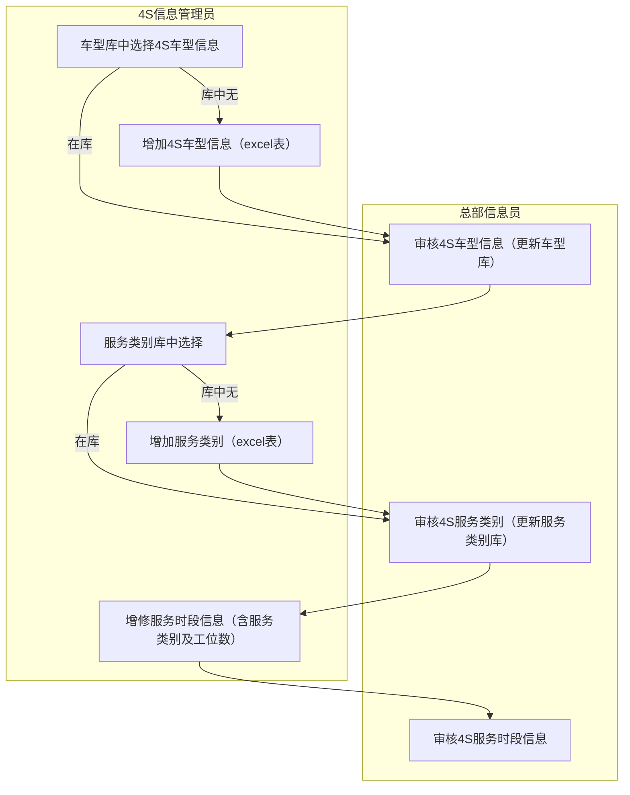
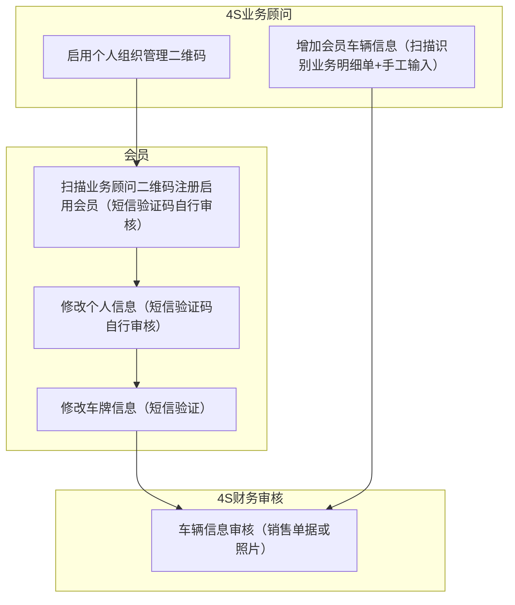
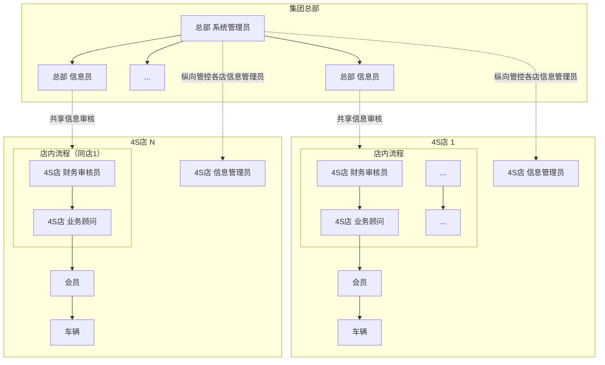
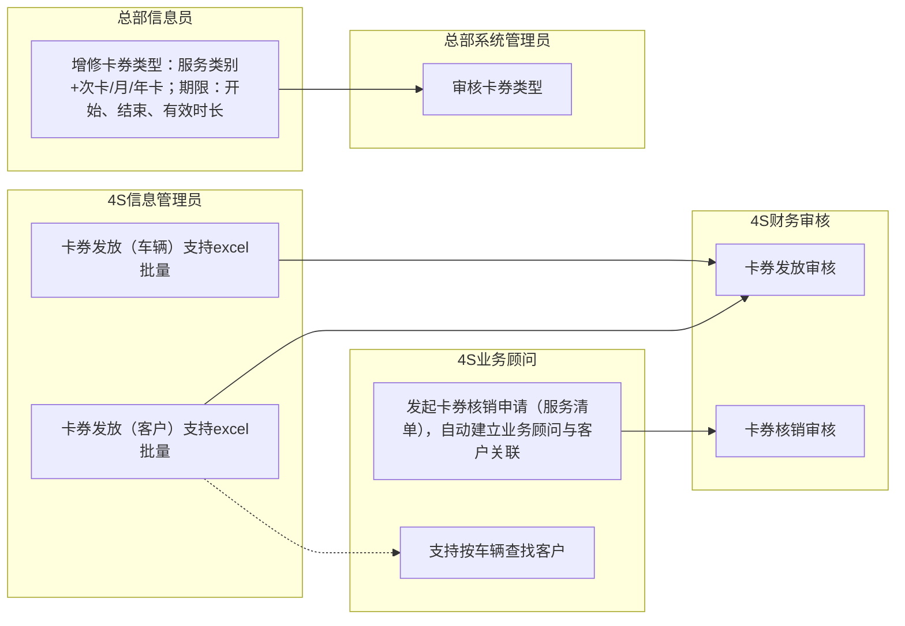
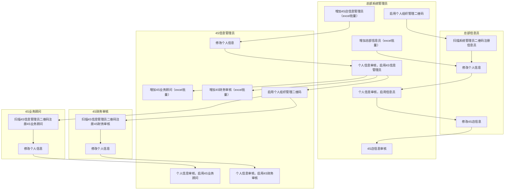

# 车友服务系统 — 业务活动图（Mermaid）

在 Cursor / VS Code 中打开本文件，使用 **Markdown 预览**（建议安装下方插件）即可渲染图中的流程。

---

## 1. 4S店基本信息管理

---

## 2. 会员及车辆管理

**注：** 修改个人信息步骤旁的业务规则为——手机更换须新旧手机号分别验证。

Mermaid 对「侧边注释」支持有限，上式用虚线示意；正式文档可在图旁保留文字说明。

---

## 3. 组织结构设计思路（信息审核 / 业务审核）

说明：**信息审核** 为 4S—总部共享审核；**业务审核** 在 4S 店内（财务审核员 → 业务顾问）。虚线框表示会员、车辆为外部实体或数据对象。

---

## 4. 卡券管理

---

## 5. 组织管理（多路径汇总）

---

## 推荐插件（Cursor / VS Code）

| 用途 | 扩展名称（在扩展市场搜索） | 说明 |
|------|---------------------------|------|
| 预览本文件中的 Mermaid | **Markdown Preview Mermaid Support** | 在 Markdown 预览里直接渲染 `mermaid` 代码块 |
| 仅预览 Mermaid | **Mermaid Chart** 或 **Mermaid Preview** | 可单独打开 `.mmd` 文件预览 |
| 可选：PlantUML | **PlantUML** | 需本机 Java；复杂泳道图用 `.puml` 更贴近 UML（见同目录 `diagrams/*.puml`） |

预览快捷键：`Ctrl+Shift+V`（打开预览）；分栏预览：`Ctrl+K` 再按 `V`。
