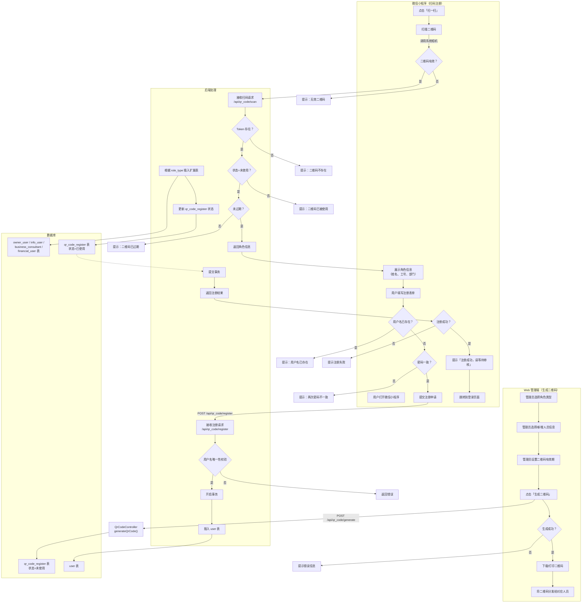
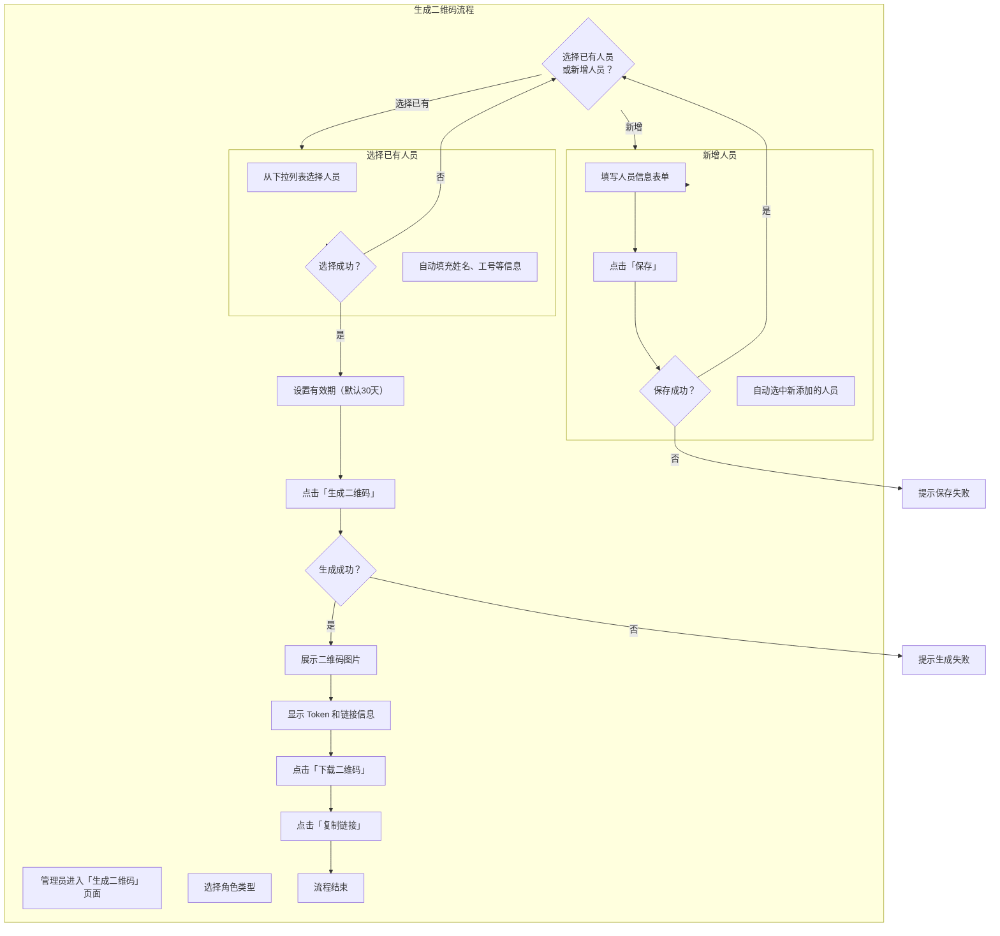
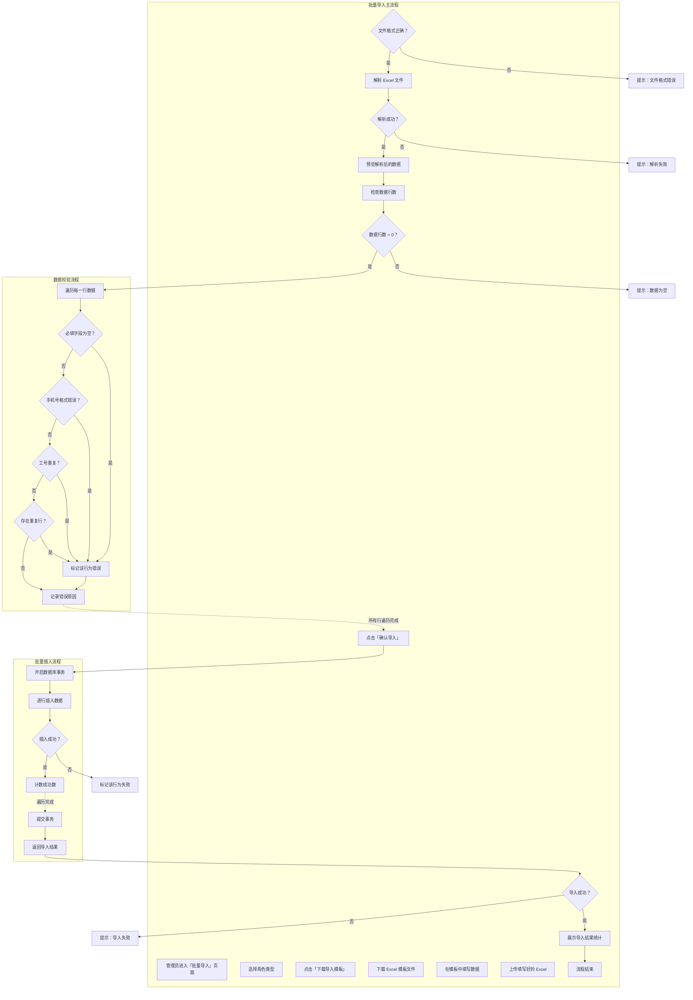
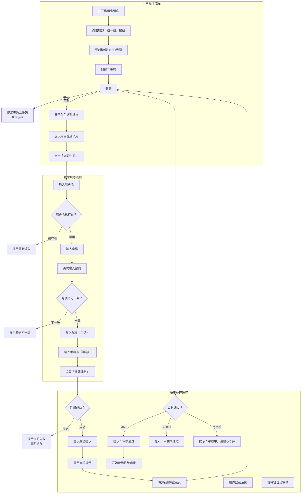
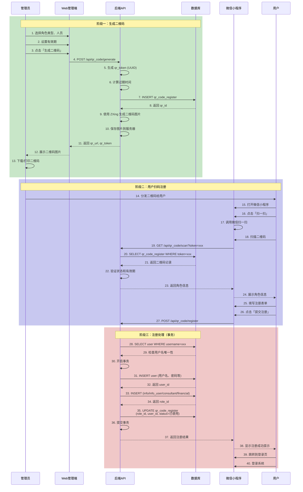
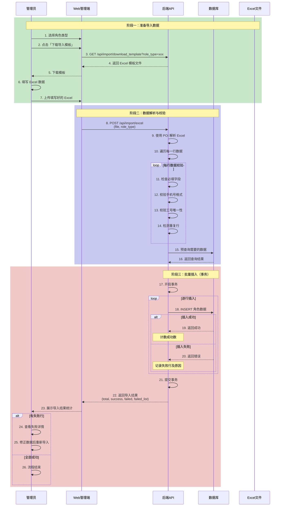
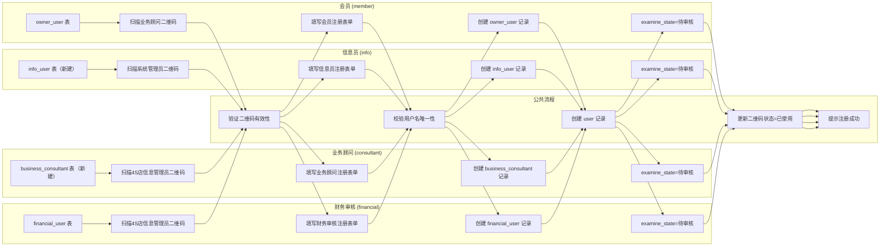
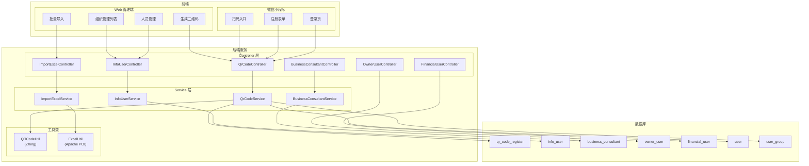

# 组织管理模块 — 个人二维码与扫码注册 活动图

> **标签：** `#功能模块` `#扫码注册` `#活动图` `#小程序` `#Web管理端` `#V1.0`
>
> **不上传 GitHub：** 本文档仅本地存储

## 文档信息

| 项目 | 内容 |
|------|------|
| 版本 | V1.0 |
| 日期 | 2026-04-05 |
| 状态 | 设计中 |
| 存储位置 | 本地文档，不上传代码仓库 |

---

## 阅读说明

本文件使用 **Mermaid** 格式绘制活动图（流程图）。在 Cursor / VS Code 中打开本文件，使用 **Markdown 预览**（`Ctrl+Shift+V`）即可渲染图中流程。

推荐安装插件：**Markdown Preview Mermaid Support**

---

## 一、扫码注册整体流程

### 1.1 扫码注册完整流程图

---

## 二、Web 管理端 — 二维码生成流程

### 2.1 生成二维码流程

---

## 三、Web 管理端 — 批量导入流程

### 3.1 批量导入完整流程

---

## 四、微信小程序 — 扫码注册详细流程

### 4.1 扫码注册用户端流程

---

## 五、二维码生成与扫码注册时序图

### 5.1 扫码注册完整时序

---

## 六、批量导入时序图

### 6.1 Excel 批量导入时序

---

## 七、四类角色扫码注册流程对比

### 7.1 角色注册流程差异

**图例：**
- `owner_user` ✅ 已有
- `financial_user` ✅ 已有
- `info_user` ❌ 新建（信息员专用）
- `business_consultant` ❌ 新建（业务顾问专用，与 business_user 商家用户不同）

---

## 八、批量导入 — 不同角色字段差异

### 8.1 各角色导入字段对比

```mermaid
flowchart TB
    subgraph MemberFields["会员 (member) → owner_user 表 ✅已有"]
        MF1["车主姓名 *"]
        MF2["车主性别"]
        MF3["联系号码 *"]
        MF4["驾驶证件"]
        MF5["会员等级"]
    end

    subgraph InfoFields["信息员 (info) → info_user 表 ❌新建"]
        IF1["员工工号 *"]
        IF2["员工姓名 *"]
        IF3["员工性别"]
        IF4["联系号码"]
        IF5["部门"]
    end

    subgraph ConsultantFields["业务顾问 (consultant) → business_consultant 表 ❌新建"]
        CF1["员工工号 *"]
        CF2["员工姓名 *"]
        CF3["性别"]
        CF4["联系号码"]
        CF5["部门"]
    end

    subgraph FinancialFields["财务审核 (financial) → financial_user 表 ✅已有"]
        FF1["员工工号 *"]
        FF2["员工姓名 *"]
        FF3["性别"]
        FF4["联系号码"]
    end

    subgraph Validation["统一校验规则"]
        V1["必填字段检查"]
        V2["手机号：11位数字"]
        V3["工号：唯一性检查"]
        V4["姓名：非空检查"]
        V5["性别：枚举值检查"]
    end

    MF1 --> V1
    MF3 --> V2
    IF1 --> V3
    IF2 --> V4
    IF3 --> V5
    CF1 --> V1
    CF2 --> V1
    CF3 --> V5
    FF1 --> V1
    FF2 --> V1
```

**注：** 标有 `*` 的字段为必填字段。
- ✅ `owner_user`、`financial_user`：直接复用现有表
- ❌ `info_user`、`business_consultant`：需新建表

---

## 九、错误处理流程

### 9.1 二维码相关错误处理

```mermaid
flowchart TB
    subgraph ScanErrors["扫码阶段错误"]
        SE1["Token 不存在"]
        SE2["二维码已被使用"]
        SE3["二维码已过期"]
        SE4["网络请求失败"]
    end

    subgraph RegisterErrors["注册阶段错误"]
        RE1["用户名已存在"]
        RE2["密码为空"]
        RE3["两次密码不一致"]
        RE4["Token 已失效"]
        RE5["数据库插入失败"]
        RE6["事务回滚"]
    end

    subgraph ImportErrors["批量导入错误"]
        IE1["文件格式错误"]
        IE2["文件解析失败"]
        IE3["必填字段为空"]
        IE4["手机号格式错误"]
        IE5["工号重复"]
        IE6["数据行为空"]
    end

    SE1 -->|"提示"| ErrS1["二维码不存在，请联系管理员"]
    SE2 -->|"提示"| ErrS2["二维码已被使用"]
    SE3 -->|"提示"| ErrS3["二维码已过期，请重新生成"]
    SE4 -->|"提示"| ErrS4["网络异常，请重试"]

    RE1 -->|"提示"| ErrR1["用户名已被注册，请更换"]
    RE2 -->|"提示"| ErrR2["密码不能为空"]
    RE3 -->|"提示"| ErrR3["两次密码输入不一致"]
    RE4 -->|"提示"| ErrR4["注册链接已失效"]
    RE5 -->|"提示"| ErrR5["注册失败，请重试"]
    RE6 -->|"提示"| ErrR6["注册失败，数据已回滚"]

    IE1 -->|"提示"| ErrI1["请上传 .xlsx 或 .xls 格式文件"]
    IE2 -->|"提示"| ErrI2["文件解析失败，请检查格式"]
    IE3 -->|"高亮"| ErrI3["标注必填字段为空的行"]
    IE4 -->|"高亮"| ErrI4["标注手机号格式错误的行"]
    IE5 -->|"高亮"| ErrI5["标注工号重复的行"]
    IE6 -->|"跳过"| ErrI6["跳过空行继续处理"]
```

---

## 十、整体架构总览

### 10.1 组织管理模块整体架构

---

## 推荐插件（Cursor / VS Code）

| 用途 | 扩展名称 | 说明 |
|------|----------|------|
| 预览本文件中的 Mermaid | **Markdown Preview Mermaid Support** | 在 Markdown 预览里直接渲染 `mermaid` 代码块 |
| 仅预览 Mermaid | **Mermaid Chart** 或 **Mermaid Preview** | 可单独打开 `.mmd` 文件预览 |
| 可选：PlantUML | **PlantUML** | 需本机 Java；复杂泳道图用 `.puml` 更贴近 UML |

预览快捷键：`Ctrl+Shift+V`（打开预览）；分栏预览：`Ctrl+K` 再按 `V`。
